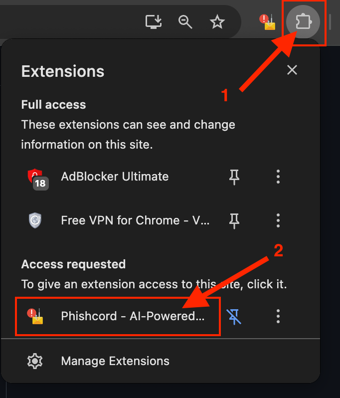

# Phishcord - AI-Powered Phishing Email Detector
Phishcord delivers a Google Chrome extension that aims to enhance the email security for Chrome users by implementing real-time detection and improving existing solutions.
INM450 Individual Project

## 🔧 Installation
To install Phishcord, follow these steps:
1. Clone the repository (assuming you already have Git installed): 
    * Open Terminal or Command Prompt
    * Run:
      ```bash
      git clone https://github.com/AymenCity/phishcord-phishing-detector
      ```
2. Ensure you have Python 3.9 or higher
3. Ensure you have Chrome version 135 or higher installed
4. Load the extension into Chrome:
    * Open Google Chrome
    * Go to `chrome://extensions`
    * Enable Developer Mode (top right)
    * Click "Load unpacked" 
    * Select the folder where you cloned the repository
5. Install backend dependencies: 
    * Go to Terminal in project folder
    * Run:
        * **macOS / Linux:**
        ```bash
        pip3 install -r requirements.txt
        ```
        * **Windows:**
        ```bash
        pip install -r requirements.txt
        ```
6. Start the backend server: 
    * Still in the project folder, run:
        * **macOS / Linux:**
        ```bash
        python3 app.py
        ```
        * **Windows:**
        ```bash
        python app.py
        ```
 
## 🚀 Usage
To use Phishcord, follow these steps:

1. Open Google Chrome
2. Activate Phishcord by clicking the Extension icon (screenshot below)




3. To change the model:
    * Click on the settings icon (screenshot below)
    
    
    * It will display a dropdown list where you can choose a model (SVC is on by default)
    * (Click on the setting icon again to close it)
4. To manually test the detection:
    * Click on the keyboard icon (screenshot below)
    
    
    * A text area will appear for you to type your message
    * Click the predict button
    * It will display the prediction and explanation result
    * (Click on the keyboard icon again to close it)
5. To **AUTO DETECT** with your email:
    * Go to Gmail and login with your account
    * Ensure that your Gmail account has 2-factor-authentication enabled
    * Create an [App Password](https://support.google.com/mail/answer/185833?hl=en-GB)
    * Rename `.env.example` to `.env`
    * Open `.env` with Notepad, update the following:
        * USER_EMAIL: your email address
        * USER_PASSWORD: your App Password (not your actual password!)
    * Click the Start Button
    * Send an email to the email you have specified on .env
    * Once email has been picked up, you shall receive an alert sound with its prediction & explanation result

## 📄 License
* This project is licensed under the MIT License.

## 📊 Dataset Acknowledgment
* This project used the **Phishing Email Dataset** dataset, available on https://www.kaggle.com/datasets/naserabdullahalam/phishing-email-dataset/data.  
* The dataset is licensed under the [Creative Commons Attribution-ShareAlike 4.0 International License (CC BY-SA 4.0)](https://creativecommons.org/licenses/by-sa/4.0/).
* All rights to the dataset belong to the original creators.

## ❓ FAQ
**Q:** How do I install Phishcord?

**A:** Follow the installation steps in the README file.

**Q:** How do I use Phishcord?

**A:** Follow the usage steps in the README file.

**Q:** My Start/Stop button is frozen and unresponsive, how do I fix?

**A:** Ensure that app.py is running. If it is running, then you may have terminated app.py (Ctrl+C terminal) whilst the Start/Stop was toggled as another state. If this occurs, close and open the extension from clicking the Extension icon on Chrome. The software will fix itself by checking the status of the imap process.

**Q:** The results aren't showing up when auto-detecting, how do I fix?

**A:** Ensure that app.py is running. Ensure you're connected to the internet. If it is running, then terminate and run app.py again, click the Start button and send an email to the email you have specified on .env - the likelihood of this occurring is lower ever since I've implemented sessions.

**Q:** Do I need to have the Gmail website to be displayed when auto-detecting?

**A:** No.

**Q:** How do I disable the alert sound when it detects? 

**A:** Click on the sound icon to toggle the alert sound on/off. (screenshot below)


**Q:** Why is SVC toggled on by default? What's the best model?

**A:** Each model is different with its own strengths and drawbacks. SVC has the highest accuracy (around 98%) out of the other models, but it's also the slowest. The models (SVC, Random Forest, Naive Bayes and XGBoost) were all chosen due to its best performance in detecting phishing emails. It can be chosen when selecting it from the settings dropdown (see Usage Step 3)
* SVC: 98.769%
* Random Forest: 98.465%
* Naive Bayes: 95.352%
* XGBoost: 98.562%
Try out the manual detection (see Usage Step 4) to test them yourself and see which model works best for you. 

**Q:** Why when I run the auto-detection, it detects my old emails?

**A:** This is due to how the script is setup as it detects any unread emails that you haven't opened. Ensure that all mails are opened before the email is sent to the email you have specified on .env

**Q:** I can't see .env.example file

**A:** Ensure that you can see your hidden files. If that doesn't work, please download the .env.example from https://github.com/AymenCity/phishcord-phishing-detector and paste the file to the project folder.

**Q** Can I use Phishcord with Outlook, Yahoo, or other providers?

**A** Phishcord supports any email service that allows basic IMAP authentication using an email address and password (App Password). Unfortunately, some providers (like Outlook) have disabled this and require OAuth 2.0 authentication via Azure, which adds complexity and may involve paid plans. For now, Phishcord is optimised for Gmail.

## ❤️ Thank you
The format of my README guide was inspired from https://medium.com/@sumudithalanz/the-art-of-crafting-an-effective-readme-for-your-github-project-cf425a8b1580 
